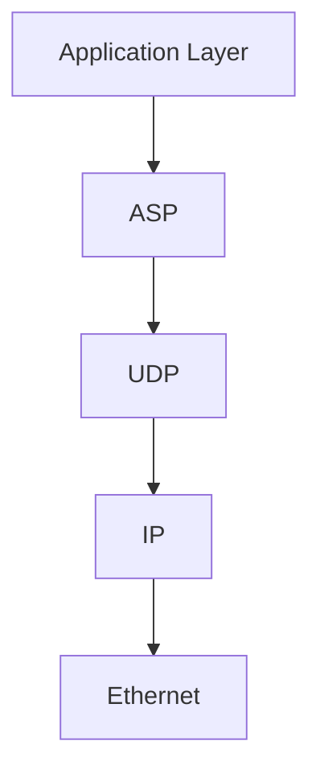

# WIP: Avalanche Stream Protocol (ASP) Specification

## Table of Contents
1. [Introduction](#1-introduction)
2. [Protocol Overview](#2-protocol-overview)
3. [Packet Structure](#3-packet-structure)
4. [Protocol Operations](#4-protocol-operations)
5. [Client Management Network](#5-client-management-network)
6. [Time Synchronization](#6-time-synchronization)

## 1. Introduction

The Avalanche Stream Protocol (ASP) is an advanced, low-latency streaming protocol designed specifically for high-performance home network environments. It caters to enthusiasts who demand the utmost in quality and responsiveness from their multi-device setups. ASP is built on the principle that in a controlled, high-quality network environment, we can push the boundaries of what's possible in real-time streaming.

### 1.1 Design Philosophy

At the core of ASP's design is the recognition that home networks, particularly those set up by enthusiasts, offer a unique opportunity. Unlike the wider internet, where varying network conditions necessitate conservative approaches, a well-configured home network allows for optimizations that prioritize performance above all else.

ASP makes several key assumptions:
1. The network is primarily wired, offering high bandwidth and low, consistent latency.
2. The number of devices is relatively small (typically under a few dozen).
3. Users are willing to properly configure their network for optimal performance.

With these assumptions in mind, ASP aggressively optimizes for low latency and high quality, sometimes at the expense of features that would be necessary in less controlled environments.

### 1.2 Key Objectives

1. **Minimal Latency**: Every aspect of the protocol is designed to reduce latency to the absolute minimum. This includes using UDP as the transport layer, minimizing handshakes, and optimizing packet structures.

2. **Maximum Quality**: Within the constraints of the available bandwidth, ASP aims to deliver the highest possible quality. This is achieved through adaptive bitrate techniques and efficient codec usage.

3. **Precise Synchronization**: For multi-device setups to work seamlessly, precise timing is crucial. ASP implements a custom synchronization mechanism that achieves nanosecond-level precision across devices.

4. **Efficient Bandwidth Utilization**: While ASP assumes a high-bandwidth environment, it still strives to use that bandwidth efficiently, allowing for multiple high-quality streams to coexist.

5. **Flexibility**: ASP is designed to handle various types of streams, from high-resolution video to low-latency input device data, all within the same protocol framework.

## 2. Protocol Overview

The Avalanche Stream Protocol operates directly over UDP, eschewing the overhead of TCP to achieve the lowest possible latency. It defines a set of packet types and operations that together create a robust streaming ecosystem.

### 2.1 Protocol Stack

ASP sits directly above UDP in the network stack:



This position allows ASP to have fine-grained control over packet transmission while benefiting from the simplicity and speed of UDP.

### 2.2 Key Features

1. **Direct Peer-to-Peer Streaming**: Streams are established directly between devices, without intermediate servers or relays.

2. **Nanosecond-Precision Timing**: All packets are timestamped with nanosecond precision, enabling extremely accurate synchronization and timing operations.

3. **Adaptive Quality Control**: The protocol continuously monitors network conditions and adjusts stream parameters in real-time to maintain the best possible quality.

4. **Multiple Stream Support**: A single connection between two devices can support multiple independent streams, each with its own characteristics and priorities.

5. **Minimal Handshaking**: Stream establishment is designed to be as quick as possible, with minimal back-and-forth required before data can start flowing.

6. **Flexible Payload Types**: ASP can carry various types of payload, from video and audio to input device data and custom application-specific data types.

## 3. Packet Structure

The Avalanche Stream Protocol (ASP) defines a set of packet structures optimized for low-latency, high-performance streaming in home network environments. These structures are designed to work in conjunction with the client management network, which handles higher-level operations such as capability negotiation and time synchronization.

### 3.1 Common Header

Every ASP packet begins with a common header:

```
 0                   1                   2                   3
 0 1 2 3 4 5 6 7 8 9 0 1 2 3 4 5 6 7 8 9 0 1 2 3 4 5 6 7 8 9 0 1
+-+-+-+-+-+-+-+-+-+-+-+-+-+-+-+-+-+-+-+-+-+-+-+-+-+-+-+-+-+-+-+-+
|    Version    |   Packet Type  |           Stream ID           |
+-+-+-+-+-+-+-+-+-+-+-+-+-+-+-+-+-+-+-+-+-+-+-+-+-+-+-+-+-+-+-+-+
|                       Sequence Number                          |
|                                                                |
+-+-+-+-+-+-+-+-+-+-+-+-+-+-+-+-+-+-+-+-+-+-+-+-+-+-+-+-+-+-+-+-+
|                         Timestamp (ns)                         |
|                                                                |
+-+-+-+-+-+-+-+-+-+-+-+-+-+-+-+-+-+-+-+-+-+-+-+-+-+-+-+-+-+-+-+-+
```

- **Version** (8 bits): Protocol version, allowing for future extensions.
- **Packet Type** (8 bits): Identifies the type of packet (e.g., DATA, INIT, FIN).
- **Stream ID** (16 bits): Uniquely identifies the stream within the sender-receiver pair.
- **Sequence Number** (64 bits): Monotonically increasing number for ordering and loss detection.
- **Timestamp** (64 bits): Nanosecond precision timestamp, using the network-synchronized time.

### 3.2 Packet Types

ASP defines the following packet types:

1. **DATA**: Carries the actual stream payload.
2. **FIN**: Indicates the end of a stream.
3. **ACK**: Acknowledges receipt of critical packets.

### 3.3 DATA Packet

The DATA packet is the primary carrier of stream content:

```
 0                   1                   2                   3
 0 1 2 3 4 5 6 7 8 9 0 1 2 3 4 5 6 7 8 9 0 1 2 3 4 5 6 7 8 9 0 1
+-+-+-+-+-+-+-+-+-+-+-+-+-+-+-+-+-+-+-+-+-+-+-+-+-+-+-+-+-+-+-+-+
|                         Common Header                          |
|                              ...                               |
+-+-+-+-+-+-+-+-+-+-+-+-+-+-+-+-+-+-+-+-+-+-+-+-+-+-+-+-+-+-+-+-+
|   Flags       |                  Reserved                      |
+-+-+-+-+-+-+-+-+-+-+-+-+-+-+-+-+-+-+-+-+-+-+-+-+-+-+-+-+-+-+-+-+
|                         Payload Length                         |
+-+-+-+-+-+-+-+-+-+-+-+-+-+-+-+-+-+-+-+-+-+-+-+-+-+-+-+-+-+-+-+-+
|                            Payload                             |
|                              ...                               |
+-+-+-+-+-+-+-+-+-+-+-+-+-+-+-+-+-+-+-+-+-+-+-+-+-+-+-+-+-+-+-+-+
```

- **Flags** (8 bits): Packet-specific flags (e.g., key frame indicator for video).
- **Reserved** (24 bits): Reserved for future use.
- **Payload Length** (32 bits): Length of the payload in bytes.
- **Payload**: The actual stream data.

### 3.5 FIN Packet

The FIN packet signals the end of a stream:

```
 0                   1                   2                   3
 0 1 2 3 4 5 6 7 8 9 0 1 2 3 4 5 6 7 8 9 0 1 2 3 4 5 6 7 8 9 0 1
+-+-+-+-+-+-+-+-+-+-+-+-+-+-+-+-+-+-+-+-+-+-+-+-+-+-+-+-+-+-+-+-+
|                         Common Header                          |
|                              ...                               |
+-+-+-+-+-+-+-+-+-+-+-+-+-+-+-+-+-+-+-+-+-+-+-+-+-+-+-+-+-+-+-+-+
|                    Final Sequence Number                       |
|                                                                |
+-+-+-+-+-+-+-+-+-+-+-+-+-+-+-+-+-+-+-+-+-+-+-+-+-+-+-+-+-+-+-+-+
|                       Reason Code                              |
+-+-+-+-+-+-+-+-+-+-+-+-+-+-+-+-+-+-+-+-+-+-+-+-+-+-+-+-+-+-+-+-+
```

- **Final Sequence Number** (64 bits): The sequence number of the last DATA packet in the stream.
- **Reason Code** (32 bits): Indicates the reason for stream termination.

### 3.6 ACK Packet

The ACK packet acknowledges receipt of packets:

```
 0                   1                   2                   3
 0 1 2 3 4 5 6 7 8 9 0 1 2 3 4 5 6 7 8 9 0 1 2 3 4 5 6 7 8 9 0 1
+-+-+-+-+-+-+-+-+-+-+-+-+-+-+-+-+-+-+-+-+-+-+-+-+-+-+-+-+-+-+-+-+
|                         Common Header                          |
|                              ...                               |
+-+-+-+-+-+-+-+-+-+-+-+-+-+-+-+-+-+-+-+-+-+-+-+-+-+-+-+-+-+-+-+-+
|                  Acknowledged Sequence Number                  |
|                                                                |
+-+-+-+-+-+-+-+-+-+-+-+-+-+-+-+-+-+-+-+-+-+-+-+-+-+-+-+-+-+-+-+-+
|                      Subsequent Count                          |
+-+-+-+-+-+-+-+-+-+-+-+-+-+-+-+-+-+-+-+-+-+-+-+-+-+-+-+-+-+-+-+-+
|                   Acknowledgment Bitmap                        |
|                              ...                               |
+-+-+-+-+-+-+-+-+-+-+-+-+-+-+-+-+-+-+-+-+-+-+-+-+-+-+-+-+-+-+-+-+
```

- **Acknowledged Sequence Number** (64 bits): An initial sequence number 
- **Subsequent Count** (32 bits): The number of subsequent packets acknowledged in this ACK.
- **Acknowledgment Bitmap** (Variable length): Bitmap indicating receipt status of subsequent packets (1 bit per packet, 1 = received, 0 = missing). Note that this will be chunked into 64-bit words, and the number of words will be determined by the subsequent count, rounding up to the nearest word.

## 4. Protocol Operations

ASP defines a set of operations for managing streams within the context of the client management network. These operations focus on the efficient establishment, maintenance, and termination of streams, while relying on the client management network for higher-level coordination.

### 4.1 Stream Initialization

Stream initialization in ASP is a streamlined process, that utilizes the client management network for negotiation and coordination:

1. **Connect Request**: The clients communicate over the client management network to negotiate stream parameters and capabilities, and a proposed 16-bit stream ID.
2. **Negotiation**: The receiving client checks its capabilities and resources to determine if it can accept the stream. If it can, it replies with a connect acknowledgment with a confirmation. If it cannot, it replies with a connect acknowledgment with a rejection specifying the reason.
3. **Synchronization**: At point of stream initialization, both sending and receiving clients should be actively time-synchronized in the client management network.
4. **Stream ID reservation**: The sending client broadcasts the agreed stream ID to all clients in the network to reserve it.
5. **Conflict Resolution**: If a client receives a reservation announcement for a stream ID it is already using, it should gracefully terminate its stream and free up the ID. This should be an uncommon occurrence.
6. **Abuse Detection**: If a client repeatedly reserves stream IDs that are already in use (more than twice in a short period), the client that detects this should report it to the client management network in a KICK request, requesting all clients ignore the offending client's messages.
7. **Listening**: The receiving client opens a port to listen for incoming stream data.

As clients should already know each other's capabilities and resources from the client management network, the stream initialization process should be as simple as a single round-trip negotiation most of the time.

### 4.2 Data Transmission

Once a stream is initialized, data transmission proceeds as follows:

1. **Packetization**:
   - The sender breaks the stream data into appropriately sized packets.
   - Each packet is assigned a monotonically increasing sequence number.

2. **Timestamping**:
   - Each packet is timestamped using the network-synchronized time.

3. **Transmission**:
   - DATA packets are sent to the receiver without waiting for acknowledgments.

4. **Flow Control**:
   - The sender adjusts its transmission rate based on feedback from the receiver and network conditions reported by the client management network.

### 4.3 Acknowledgment and Loss Handling

ASP uses a batched acknowledgment system to detect packet loss:

1. **Periodic ACKs**:
   - The receiver periodically sends ACK packets.
   - These ACKs include:
     * An initial contiguously received sequence number
     * A count of subsequent packets acknowledge in this ACK
     * A bitmap of subsequently received packets, where each bit represents that packets status (success or failure)

2. **Sender Adaptation**:
   - The sender uses ACKs to track which packets have been successfully received.
   - The sender will not retransmit lost packets, as they will be out-of-date by the time they are received.
   - The sender uses ACKs to adjust its transmission strategy, possibly by reducing packet size, increasing data-redundancy, or adjusting bitrate.

### 4.4 Stream Termination

Stream termination in ASP is designed to be clean and efficient:

1. **FIN Packet**:
   - When a stream needs to be terminated, the sender transmits a FIN packet.
   - This packet includes:
     * The final sequence number
     * A reason code for termination

2. **Receiver Acknowledgment**:
   - The receiver sends an ACK for the FIN packet.

3. **Cleanup**:
   - Both sender and receiver clean up resources associated with the stream.

4. **Client Management Network Update**:
   - The client management network is notified of the stream termination, allowing it to update its stream tables and potentially reallocate resources.

### 4.5 Error Handling

ASP includes mechanisms for handling various error conditions:

1. **Unrecoverable Packet Loss**:
   - In cases of severe packet loss, ASP may trigger a stream reset or termination.

2. **Timeout Handling**:
   - If no packets are received for a stream within a specified timeout period, the receiver may initiate termination.

3. **Client Failure**:
   - Clients should receive notification of client failures from the client management network, which may trigger stream termination.

### 4.6 Quality of Service

While ASP itself doesn't implement complex QoS mechanisms, it provides hooks for higher-level QoS management:

1. **Priority Hints**:
   - Streams can be assigned priority levels, allowing the network layer to make intelligent queuing decisions.

2. **Bandwidth Adaptation**:
   - ASP can adjust its packet sizes and transmission rates based on feedback from the client management network about available bandwidth.

3. **Latency Management**:
   - Time-critical streams (e.g., input device data) can be flagged for special handling to minimize latency.

By focusing on these core operations and leveraging the client management network for higher-level coordination, ASP achieves a balance of simplicity and power. This design allows for efficient, low-latency streaming while still providing the flexibility needed for complex multi-stream, multi-device scenarios in high-performance home networks.

## 5. Client Management Network

The Client Management Network is a crucial component of the Avalanche Stream Protocol (ASP), providing the foundation for device coordination, stream management, and system-wide optimization. This network is designed to leverage the characteristics of high-performance home networks while ensuring robustness, efficiency, and scalability.

### 5.1 Network Topology

The ASP Client Management Network employs a flat, peer-to-peer topology, reflecting the nature of home networks and maximizing flexibility and fault tolerance.

#### 5.1.1 Topology Characteristics

- **Full Mesh Connectivity**: Every client maintains a direct logical connection to every other client in the network.
- **No Central Authority**: There is no central server or controlling node, ensuring no single point of failure.
- **Equal Peer Status**: All clients are considered equal in terms of network responsibilities.

#### 5.1.2 Scalability Considerations

- The network is designed to efficiently handle up to 50 devices, which is beyond the typical needs of even advanced home setups.
- Beyond 50 devices, performance may degrade due to the O(n^2) nature of full mesh topologies.

#### 5.1.3 Topology Maintenance

- Clients maintain a real-time map of the network topology.
- This map is updated whenever clients join, leave, or become unresponsive.
- The topology map is used for optimizing communication paths and resource allocation.

### 5.2 Client Discovery

The client discovery process in ASP is designed to be automatic, efficient, and resilient to network changes.

#### 5.2.1 Discovery Protocol

1. **Network Join Initiation**
   - When a client joins the network, it enters a discovery state.
   - The client prepares a discovery packet containing:
     * Client UUID (generated using a combination of MAC address and timestamp)
     * Client IP Address and Port
     * Client Capabilities (supported stream types, hardware specs, etc.)
     * Protocol Version

2. **Multicast Announcement**
   - The client sends this discovery packet to a predefined multicast address (e.g., 239.255.43.21) and port (e.g., 5678).
   - This multicast is sent with a TTL of 1 to ensure it remains within the local network.

3. **Unicast Responses**
   - Existing clients respond directly to the new client with their own info packets.
   - These responses are staggered using a random delay (0-50ms) to prevent network flooding.

4. **Client Table Construction**
   - The new client builds its client table from the responses.
   - Each entry in the table includes:
     * Client UUID
     * IP Address and Port
     * Capabilities
     * Last Seen Timestamp
     * Link Quality Metrics

5. **Acknowledgment Broadcast**
   - After building its table, the new client sends a final multicast acknowledgment.
   - This serves to inform all clients that it has successfully joined the network.

#### 5.2.2 Periodic Announcements and Table Maintenance

- Every client broadcasts a presence announcement every 5 minutes.
- Clients update their tables based on these announcements.
- If a client hasn't been seen for 15 minutes, it's marked as potentially offline.
- After 30 minutes of no contact, a client is removed from the table.

#### 5.2.3 Rapid Re-Discovery

- If a client detects that it has changed IP addresses (e.g., due to DHCP renewal), it immediately initiates the discovery process again.
- This ensures minimal disruption in case of network changes.

### 5.3 Stream Management

Stream management in the ASP Client Management Network is a cooperative process that ensures efficient use of network resources and optimal user experience.

#### 5.3.1 Stream Initialization

1. **Stream Request**
   - Client A wants to start a stream to Client B.
   - A sends a Stream Request message directly to B containing:
     * Source Client UUID
     * Destination Client UUID
     * Proposed Stream ID (UUID)
     * Stream Type (video, audio, input, etc.)
     * Codec and Initial Quality Parameters
     * Priority Level

2. **Capability and Resource Check**
   - B checks if it can support the requested stream type and codec.
   - B also assesses its current resource usage and network conditions.

3. **Stream Negotiation**
   - If B can support the stream, it may propose modifications to the parameters.
   - A and B may go through several rounds of negotiation to finalize stream parameters.

4. **Final Confirmation**
   - Once parameters are agreed, both A and B send a Stream Confirmation message to all clients in the network.
   - This informs other clients of the new stream for network-wide optimization.

5. **Stream Table Update**
   - All clients update their Stream Tables with the new stream info.

#### 5.3.2 Active Stream Monitoring

- Every client maintains a Stream Table containing all active streams in the network.
- Clients involved in a stream send periodic Stream Status Updates (every 1 second) to all other clients.
- These updates include:
  * Stream ID
  * Current Bitrate
  * Packet Loss Rate
  * Jitter
  * Sender/Receiver Buffer Levels

#### 5.3.3 Dynamic Stream Adjustment

- Based on Stream Status Updates, clients can request or suggest stream parameter changes.
- For example, if network congestion is detected, a client might request a reduction in bitrate for lower-priority streams.

#### 5.3.4 Stream Handoff

- If a client detects that it's approaching resource limits, it can initiate a Stream Handoff.
- The handoff process involves finding another capable client to take over as the stream destination.
- This is coordinated through the Client Management Network to ensure a smooth transition.

#### 5.3.5 Stream Termination

1. **Termination Request**
   - Either the source or destination can initiate termination by sending a Stream Termination message.

2. **Acknowledgment**
   - The other party acknowledges the termination.

3. **Network Update**
   - Both clients broadcast a Stream Ended message to all clients.
   - All clients update their Stream Tables accordingly.

### 5.4 Network Health Monitoring

The ASP Client Management Network includes comprehensive health monitoring to ensure optimal performance and quick problem detection.

#### 5.4.1 Link Quality Measurement

- Each client periodically (every 30 seconds) sends small probe packets to every other client.
- These probes measure:
  * Round-trip Time (RTT)
  * Packet Loss Rate
  * Available Bandwidth (using packet pairs)

#### 5.4.2 Resource Utilization Tracking

- Clients monitor their own resource usage:
  * CPU Utilization
  * Memory Usage
  * Network Interface Utilization
- This information is included in periodic client status broadcasts.

#### 5.4.3 Anomaly Detection

- Clients employ statistical analysis to detect anomalies in network performance or resource usage.
- Sudden changes in RTT, packet loss, or resource usage trigger alerts.

#### 5.4.4 Health Scoring

- Each client computes a health score for itself and its links to other clients.
- The health score is a weighted combination of:
  * Link Quality Metrics
  * Resource Utilization
  * Stability (time since last issue)
- Health scores are used in stream routing decisions and for triggering optimizations.

#### 5.4.5 Network-Wide Health Map

- Clients exchange their health data, building a network-wide health map.
- This map is used for:
  * Predictive problem detection
  * Optimal stream routing
  * Load balancing decisions

### 5.5 Fault Tolerance and Recovery

The Client Management Network is designed to be resilient to failures and network issues.

#### 5.5.1 Client Failure Detection

- If a client fails to respond to multiple consecutive probe packets, it's marked as potentially failed.
- After a certain threshold (e.g., 5 seconds of no response), the client is considered offline.

#### 5.5.2 Stream Recovery

- For each active stream, the network maintains a list of potential backup destinations.
- If a client failure is detected, any affected streams are quickly rerouted to backup destinations.

#### 5.5.3 Network Partitioning Handling

- In case of network partitioning, each partition continues to function independently.
- When the partition is healed, clients perform a full discovery process to reestablish the complete network topology.

#### 5.5.4 Gradual Degradation

- As network conditions degrade, the system attempts to maintain critical streams by gradually reducing quality or stopping lower-priority streams.

### 5.6 Security Considerations

While detailed security is out of scope for this specification, the Client Management Network includes basic security measures:

- All management traffic is encrypted using AES-256-GCM.
- Clients use a shared network key for initial authentication.
- The network supports client revocation in case a device is compromised.

### 5.7 Extensibility

The Client Management Network protocol is designed with extensibility in mind:

- All messages include a version field to allow for future protocol upgrades.
- The protocol includes reserved fields for future expansion.
- Clients can negotiate capability sets, allowing for the introduction of new features without breaking compatibility with older clients.

## 6. Time Synchronization

Precise time synchronization is crucial for the Avalanche system, as streams require tight synchronization across 
multiple devices. The time synchronization in ASP aims to achieve roughly millisecond accuracy across all clients 
in the network. It uses a simple averaged delay approach to compute the time offset.

### 6.1 Average Time Offsets

When a client joins the network, it starts with a time offset of 0. Every time the client receives a presence message,
it computes the offset for that client as the difference between the local time and the time in the message. It then
computes the average of the offsets from all clients to determine the final time offset.

This synchronization method is WIP - more details to be added. Depending on need, may add a sliding window per-client
to smooth out jitter.
